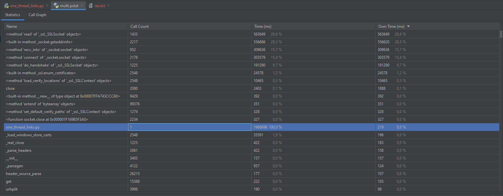
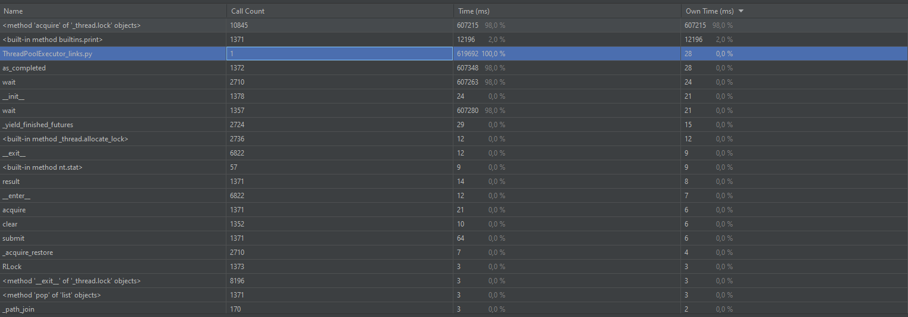
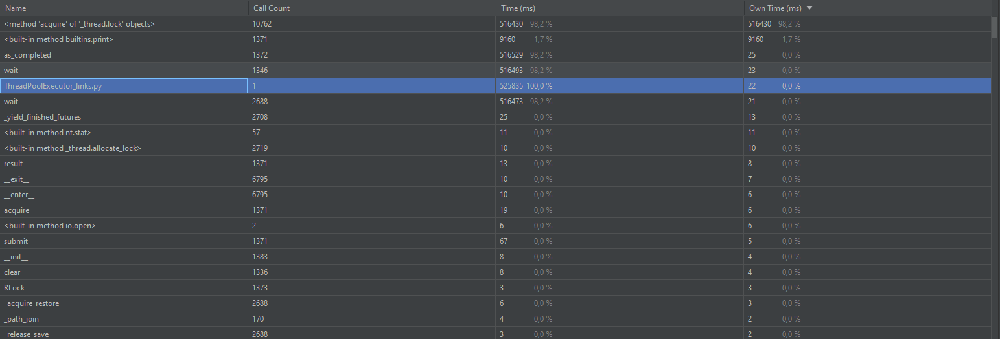
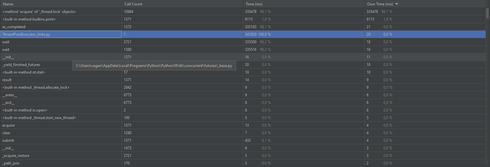
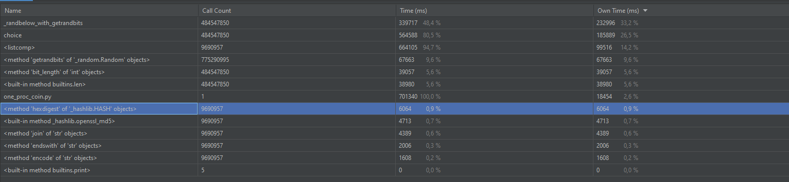

# multi
## IO-BOUND

|Синхронное выполнение|TPE: 5 воркеров|TPE: 10 воркеров|TPE: 100 воркеров|
|---------------------|---------------|----------------|-----------------|
|1968696 мс|619692 мс|525835 мс|341820 мс|

Все разы программа проверяла одни и те же ссылки (1371 штук).  
С ростом количества воркеров, т.е. с увеличением количества потоков, время выполнения программы уменьшается, так как запросы выполняются параллельно.
___

синхронное выполнение: **1968696 мс**
___

TPE: 5 воркеров: **619692 мс**
___

TPE: 10 воркеров: **525835 мс**
___

TPE: 100 воркеров: **341820 мс**
___

## CPU-BOUND
Будем ждать генерации 5 монет каждый раз.  
Пример монет:  
`72813714588008522359693905995243917214410117208724 59085477b3645c3a9b5f98b6db000000
62761583174264367159292129069154963166353479335078 757a74da99972e1fd1183f175ca00000
44222328655179734714985228626592436101365168435961 5f5ea32a4111c982c4ecccc707600000
10540096872012679444077772572701713641918323242397 9a2d2238b9607fb9766d06fad7000000
16249884668017092767768487181825482800385572561653 e4abf722fa1a318571a467b2b1300000`

|Синхронное выполнение|PPE: 2 воркеров|PPE: 4 воркеров|PPE:5 воркеров|
|---------------------|---------------|----------------|-----------------|
|701340 мс||||

синхронное выполнение: **701340 мс**
___